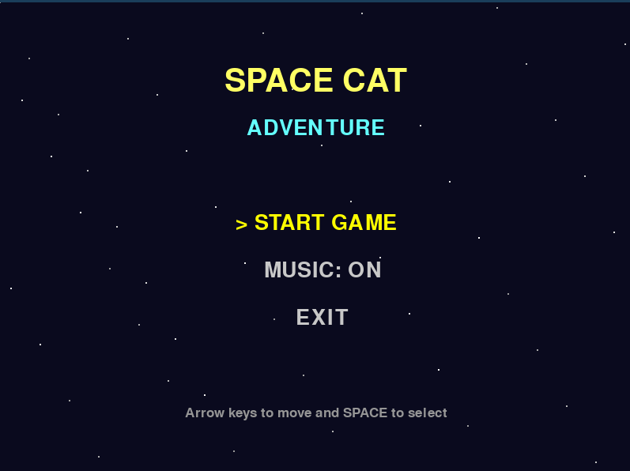
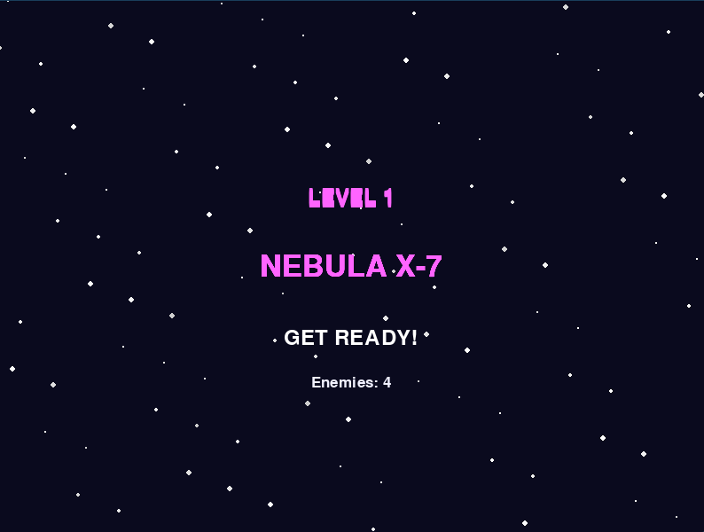

# Space Cat Adventure

**Space Cat Adventure** é um jogo 2D estilo grid-based desenvolvido em Python utilizando [PgZero](https://pygame-zero.readthedocs.io/). Você controla um gato espacial que precisa navegar por diferentes planetas, evitando inimigos e obstáculos para alcançar o portal e avançar de nível.

---

##  Como Jogar

- **Movimentação:** Use **WASD** ou **setas** do teclado.
- **Selecionar opções no menu:** **Espaço**
- **Ativar/desativar música:** tecla **M** ou clicando no botão na tela de jogo.

### Objetivo
- Sobreviver aos inimigos e alcançar o portal.
- Cada nível aumenta a quantidade de inimigos e obstáculos.
- Ao chegar no portal, você avança para o próximo planeta/nível.

---

##  Características

- Personagem principal animado com movimentos e respiração.
- Inimigos com padrões de movimento aleatórios.
- Obstáculos gerados dinamicamente.
- Sistema de níveis com nomes de planetas e cores de fundo diferentes.
- Tela de **Menu**, **Planet Intro**, **Game Over** e **Level Complete**.
- Música de fundo e efeitos sonoros (mutáveis).

---


##  Requisitos

- Python 3.10+
- PgZero

### Instalação

1. Clone o repositório:
```bash
git clone https://github.com/seuusuario/space-cat-adventure.git
```

Instale o Pygame Zero:

```bash
pip install pgzero
```

Execute o jogo:

```bash
pgzrun game.py
``` 

## Screenshots do jogo:

<video controls src="./assets-readme/jogabilidade.mp4" title="Video-demonstração jogabilidade"></video>
*Vídeo demonstrativo jogabilidade*



*Menu inicial*



*Tela de transição/início do nível*


*Screenshot tela do jogo nivel 1*


